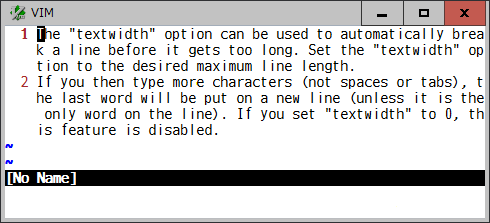

# wrapwidth

### Wraps long lines virtually at a specific column

The `wrap` option is useful but no way to select a column to be wrapped. And
the `textwidth` and `wrapmargin` options break a long line but it is hard
wrapped in insert mode.

This plugin provides the *:Wrapwidth* command to set a column at which a
longer line will be virtually wrapped. When `wrap` is on, the required number
of blank spaces are inserted as **virtual-text** at right edge of each screen
line.

While *wrapwidth* is enabled, those virtual spaces will be adjusted with
several options (such as `linebreak`, `showbreak`, `number`, `numberwidth`,
`foldcolumn`, `tabstop`) as well as the change of text and window width, which
affect the way the text is visually displayed.

And you can set some of the *wrapwidth* specific options buffer-locally or
globally to see a wrap position sign and count number on each wrapped line.

If a file is big and not necessary to virtually wrap all lines at the same
column, it is possible to specify a range to set *wrapwidth* lines.

Note that the inline **virtual-text** feature has been implemented in vim
post-9.0 patches and nvim 0.10.0.

#### Command

* `:[range]Wrapwidth N`
  * Set a *wrapwidth* at the N-th column in the current buffer. A longer line
    will be virtually wrapped at that column and continued to the next screen
    line. It is possible to specify *wrapwidth* lines in `[range]` (default: all
    lines) in a buffer.
    - N > 0: a text width from left edge of a text, like `textwidth`
    - N < 0: a wrap margin from right edge of a window, like `wrapmargin`
    - N = 0: disables the *wrapwidth*

* `:[range]Wrapwidth!`
  * Redraw the *wrapwidth* virtual spaces set in the current buffer (since
    patch 9.0.1762). It can be useful when those spaces are accidentally
    displaced by other virtual text than *wrapwidth*.

#### Options

* `b:wrapwidth_hl`, `g:wrapwidth_hl`
  * A highlight group name to make *wrapwidth* virtual spaces visible (default:
  'NonText').

* `b:wrapwidth_sign`, `g:wrapwidth_sign`
  * A string to indicate the position of the wrap column in the virtual spaces
    (default: '').

* `b:wrapwidth_number`, `g:wrapwidth_number`
  * Enable (1) or disable (0) the count number to show on each of the wrapped
    line (default: 0).
